# Substrate Node Template (with Supersig)

This node template is hooked up with Supersig so you can try it out. However if you want to look at the pallet-supersig code you can find it [here](https://github.com/kabocha-network/pallet-supersig).

# Node Template containing Pallet Supersig 

<h1 align="center">
  <a href="https://www.kabocha.network/">  </a>
  <a href="https://github.com/rusty-crewmates"> </a>
</h1>

_Funded by Web3 foundation and Edgeware_


# Supersig Pallet 

The supersig pallet extends the capabilities of a multisig so it can be fit for governance of
larger funds. With a supersig you can make group decisions on a share account, add and remove members, and have a simpleMajority threshold.

Note: the multisig addresses won’t change even though the members can be added, removed, or can
leave themselves

## Overview

The Supersig pallet provide function for:

- Creating a supersig,
- Adding and removing members,
- Leaving the supersig,
- Submit transaction to a supersig,
- Vote for the transaction,
- Remove a pending transaction,
- Delete a supersig,


### Dispatchable Functions

- `create_supersig` - create a supersig, with specified members. The creator will have to
  deposit an existencial balance and a deposit that depend on the number of members, in the
  supersig account. This last amount will be reserved on the supersig

  /!!\ note of caution /!!\ the creator of the supersig will NOT be added by default, he will
  have to pass his adress into the list of added users.

- `submit_call` - make a proposal on the specified supersig. an amount corresponding to the
  length of the encoded call will be reserved.

- `approve_call` - give a positive vote to a call. if the number of vote >= SimpleMajority, the
  call is executed. An user can only approve a call once.

- `remove_call` - remove a call from the poll. The reserved amount of the proposer will be
  unreserved

- `add_members` - add new members to the supersig. In case some user are already in the
  supersig, they will be ignored.

- `remove_members` - remove members from the supersig. In case some user are not in the
  supersig, they will be ignored.

- `remove_supersig` - remove the supersig and all the associated data. Funds will be unreserved
  and transfered to specified beneficiary.

- `leave_supersig` - remove the caller from the supersig.

### Get a node started and use the functions

- `cargo build --release`

- `./target/release/node-template --dev`

- Then go to view your node from Polkadot JS Apps development > local node https://polkadot.js.org/apps/?rpc=ws%3A%2F%2F127.0.0.1%3A9944#/addresses


## Supersig Tutorial

### Create a supersig account

Go to `Developer > Extrinsics > supersig > createSupersig(members)`

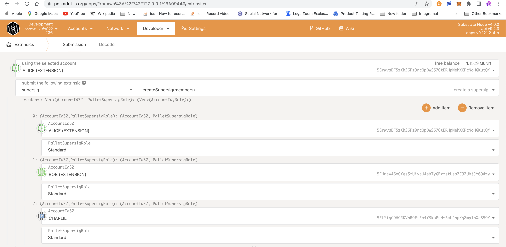
_Notice how if you are the creator of the supersig, you must also add yourself as a member._ 

### Save Supersig Address (and fund it)

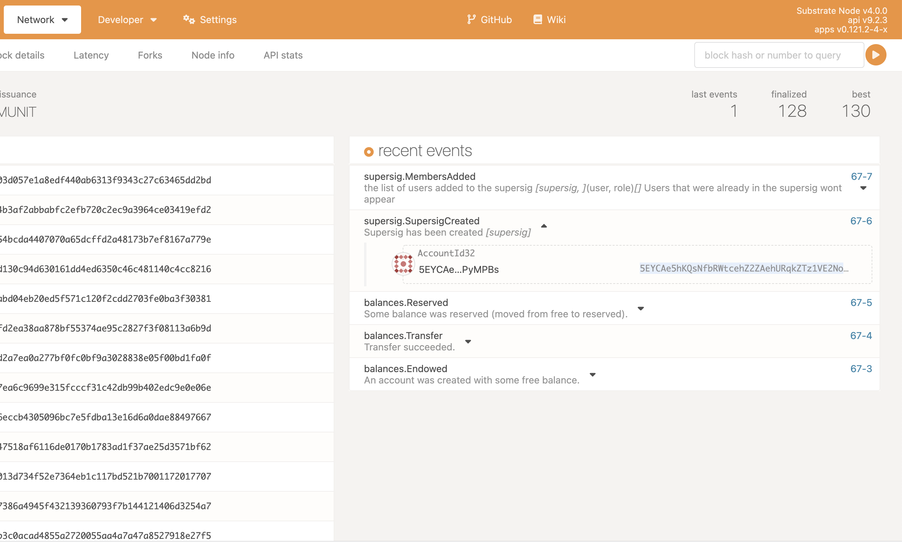
_Copy the address from event logs and add it as a contact in your address book._

- Add the supersig to your address book 
- Fund the supersig account from any account that has funds. 


### Make a call from your Supersig

Now that your supersig is funded and has members, you can create a call that needs a simpleMajority to be executed.

Go to `Developer > Extrinsics > supersig > submitCall(supersigAccount, call)`

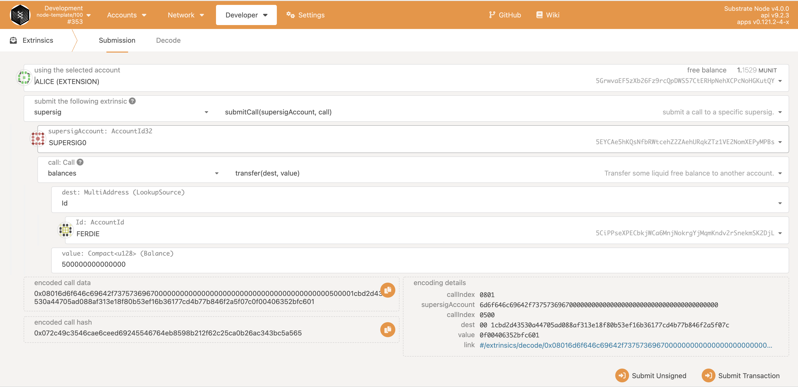
_create a call from any funded account. In this example we submit a call to send balance transfer of 500 to Ferdie. Reminder that you need to add the amount plus the number of decimals for your blockchain, in this case 12 zeroes._

### Members vote/sign transactions

Go to `Developer > Extrinsics > supersig > approveCall(supersigAccount, callId)`

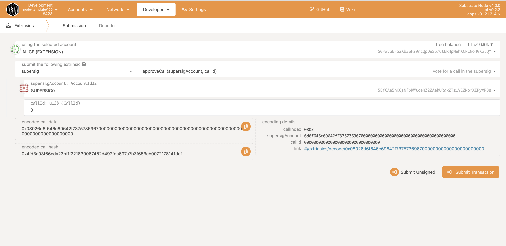
_A simpleMajority of members sign a call for the supersig account._ 

- Notice that Alice created the call, but she also has to approve the call. 
- The callId here is `0` which is a call nonce. This is the first ever call from this supersig so we know it is zero. 
- You can also view the call nonce from the event log or from  `> chain_state`. 
- Remeber to approve a call, you need to be a member with a sufficiently funded balance. 

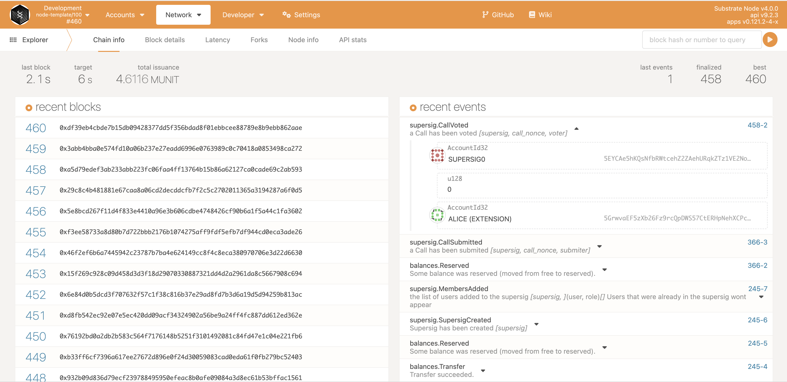
_Alice has voted on Call with nonce of `0`. Now we just need one of the 2 other members to make a simpleMajority._


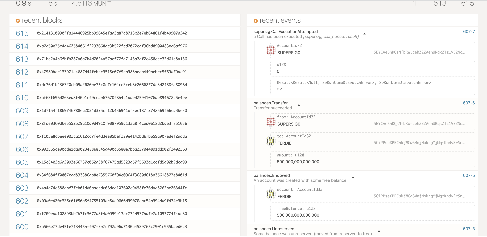
_Bob voted and then the simpleMajority threshold was reached and the Call was executed. Ferdie now receives his balance of 500._


### Add/remove members

Go to `Developer > Extrinsics > supersig > addMembers(newMembers)`

**A common mistake**

Here is a common way to submit a call. In this example we want to add a member, but just because the call is a supersig call it doesn't mean we can skip starting with `submitCall`
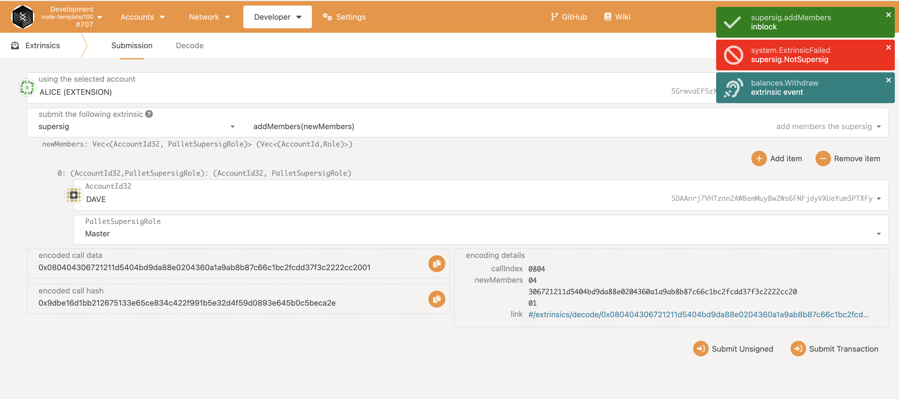
_In this example we add Dave as a member, which also requires simpleMajority vote. But wait, it did not work because we need to submitCall then addMember within the call._

**The correct way**
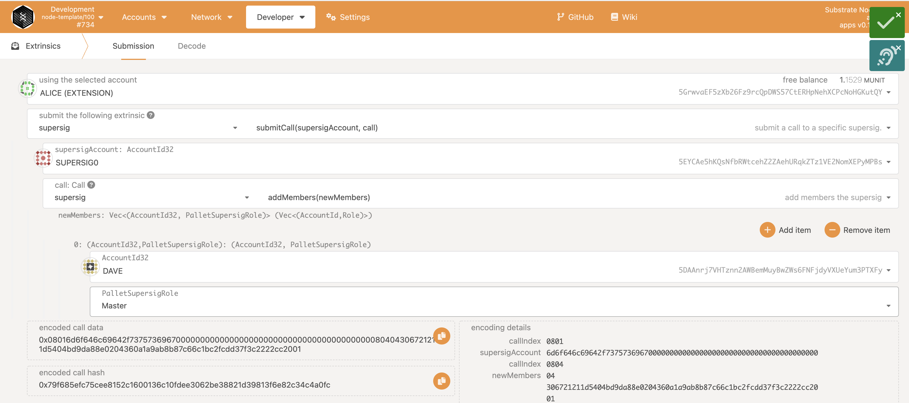
_Now we have wrapped the addMember call correctly within submitCall, and have selected the Supersig we want to interact with._

- Add a member (Dave)
- In this example we add Dave as `master`
  - This means he will have 50% voting power. And no matter how many members there are, if he votes then only one other person is required to create a `simpleMajority`.

This is the second ever call for Supersig 
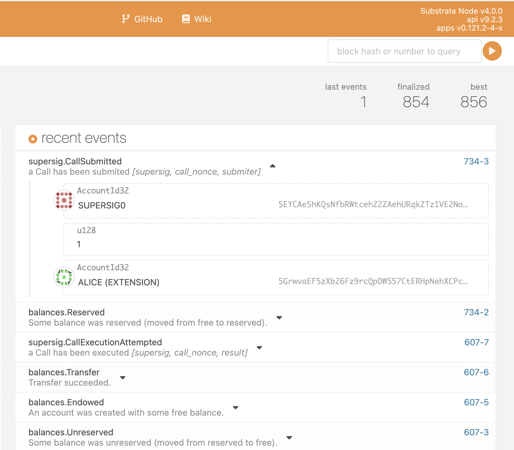
_The `callId` is now `1`._

Supersig members need to vote in order to accept Dave as a member. 

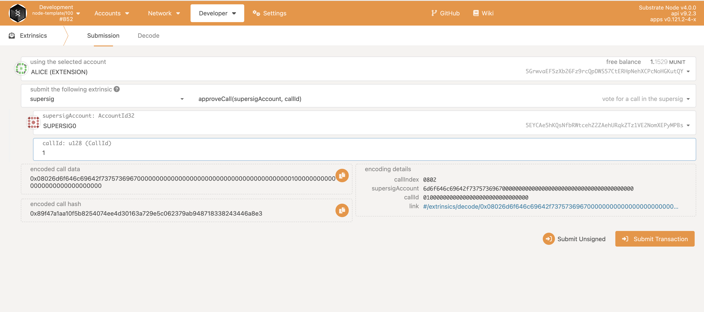
_Dont't forget to add the correct callId when voting for the call._

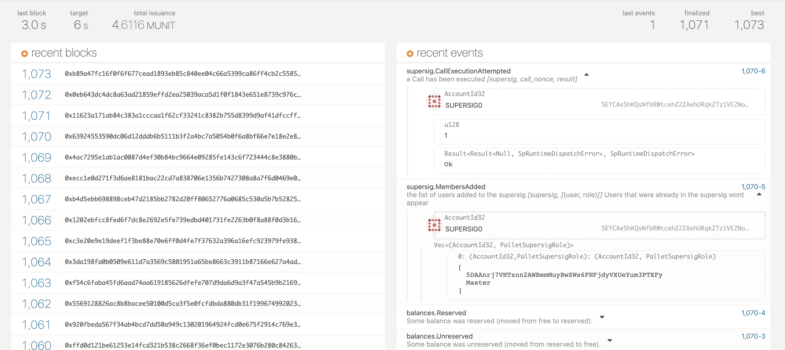
_...Alice and Bob vote and Dave is now a member of the Supersig._ 


### Get Information about your Supersig

**Find your AccountNonce from your AccountId**

Go to `Developer > Runtime Calls > accountNonceApi > accountNonce(accountId)`

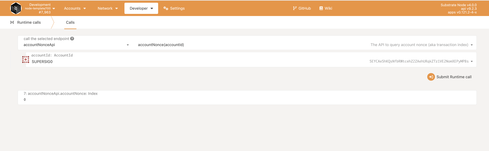
_select your AccountId to get your AccountNonce_

Your AccountNonce is the number of your Supersig that is used to represent your supersig. Here we find the nonce is `0`.

In our exmaple, there are now 4 members in the Supersig, 3 `Standard` members, and 1 `Master` member. But if we lose track of this let's check from the chain state. 

Go to `Developer > chain state > supersig > members(u128, AccountId32): PalletSupersigRole`

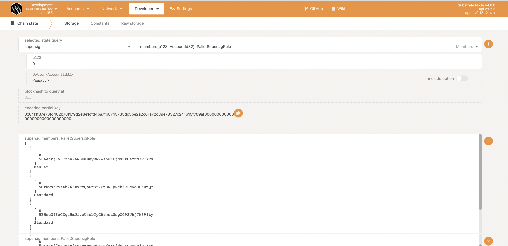

- Select the id of the supersig. In this case we know theres only one, so it's `0`
- For the second parameter `Option<AccountId32>` untick the box so that we can get a list of all the `Members` of the selected supersig.
- As we can see from the screenshot there are 4 accounts, each with their Member type (standard or master). 


## RPC
### cURL

use cURL to make rpc calls. 


- `superSig_getSupersigId` 
  - Get the SupersigId (nonce) of the supersig by providing your AccountId.
  - Parameter(s): `supersig_account: AccountId`
- `superSig_getUserSupersigs` 
  - Find what supersigs your associated to.
  - Parameter(s):`who: AccountId` the AccountId you'd like to check
- `superSig_listMembers`
  - Get list of members related to supersig. 
  - Parameter(s): `SupersigId` (nonce)
- `superSig_listProposals`
  - Get list of proposals (calls) connected to a supersig. 
  - Parameter(s): `SupersigId` (nonce)
- `superSig_getProposalState`
  - Get the state of votes after youve submitted a call for voting. 
  - Parameter(s): `SupersigId` (nonce)

### Example

**List Members**

`superSig_listMembers`

From our example we make a jsonrpc call through cURL, (assuming that your chain is running on port 9933).

```bash
curl -sS -H "Content-Type: application/json" -d '{"id":1, "jsonrpc":"2.0", "method": "superSig_listMembers", "params": [0]}' http://localhost:9933/
```

Result:

```json
{
  "jsonrpc":"2.0","result":
  [
    ["5GrwvaEF5zXb26Fz9rcQpDWS57CtERHpNehXCPcNoHGKutQY","Standard"], ["5FHneW46xGXgs5mUiveU4sbTyGBzmstUspZC92UhjJM694ty","Standard"], ["5FLSigC9HGRKVhB9FiEo4Y3koPsNmBmLJbpXg2mp1hXcS59Y","Standard"]  //Charlie
  ],
  "id":1
} //Alice, Bob and Charlie's accounts related to Supersig[0]
```


[](https://docs.substrate.io/playground/) [](https://matrix.to/#/#substrate-technical:matrix.org)

A fresh FRAME-based [Substrate](https://www.substrate.io/) node, ready for hacking :rocket:

## Getting Started

Follow the steps below to get started with the Node Template, or get it up and running right from
your browser in just a few clicks using
the [Substrate Playground](https://docs.substrate.io/playground/) :hammer_and_wrench:

### Using Nix

Install [nix](https://nixos.org/) and optionally [direnv](https://github.com/direnv/direnv) and
[lorri](https://github.com/target/lorri) for a fully plug and play experience for setting up the
development environment. To get all the correct dependencies activate direnv `direnv allow` and
lorri `lorri shell`.

### Rust Setup

First, complete the [basic Rust setup instructions](./docs/rust-setup.md).

### Run

Use Rust's native `cargo` command to build and launch the template node:

```sh
cargo run --release -- --dev
```

### Build

The `cargo run` command will perform an initial build. Use the following command to build the node
without launching it:

```sh
cargo build --release
```

## Run

The provided `cargo run` command will launch a temporary node and its state will be discarded after
you terminate the process. After the project has been built, there are other ways to launch the
node.

### Single-Node Development Chain

This command will start the single-node development chain with non-persistent state:

```bash
./target/release/node-template --dev
```

Purge the development chain's state:

```bash
./target/release/node-template purge-chain --dev
```

Start the development chain with detailed logging:

```bash
RUST_BACKTRACE=1 ./target/release/node-template -ldebug --dev
```

> Development chain means that the state of our chain will be in a tmp folder while the nodes are
> running. Also, **alice** account will be authority and sudo account as declared in the
> [genesis state](https://github.com/substrate-developer-hub/substrate-node-template/blob/main/node/src/chain_spec.rs#L49).
> At the same time the following accounts will be pre-funded:
> - Alice
> - Bob
> - Alice//stash
> - Bob//stash

In case of being interested in maintaining the chain' state between runs a base path must be added
so the db can be stored in the provided folder instead of a temporal one. We could use this folder
to store different chain databases, as a different folder will be created per different chain that
is ran. The following commands shows how to use a newly created folder as our db base path.

```bash
// Create a folder to use as the db base path
$ mkdir my-chain-state

// Use of that folder to store the chain state
$ ./target/release/node-template --dev --base-path ./my-chain-state/

// Check the folder structure created inside the base path after running the chain
$ ls ./my-chain-state
chains
$ ls ./my-chain-state/chains/
dev
$ ls ./my-chain-state/chains/dev
db keystore network
```


### Connect with Polkadot-JS Apps Front-end

Once the node template is running locally, you can connect it with **Polkadot-JS Apps** front-end
to interact with your chain. [Click
here](https://polkadot.js.org/apps/#/explorer?rpc=ws://localhost:9944) connecting the Apps to your
local node template.

### Multi-Node Local Testnet

If you want to see the multi-node consensus algorithm in action, refer to our
[Start a Private Network tutorial](https://docs.substrate.io/tutorials/v3/private-network).

## Template Structure

A Substrate project such as this consists of a number of components that are spread across a few
directories.

### Node

A blockchain node is an application that allows users to participate in a blockchain network.
Substrate-based blockchain nodes expose a number of capabilities:

- Networking: Substrate nodes use the [`libp2p`](https://libp2p.io/) networking stack to allow the
  nodes in the network to communicate with one another.
- Consensus: Blockchains must have a way to come to
  [consensus](https://docs.substrate.io/v3/advanced/consensus) on the state of the
  network. Substrate makes it possible to supply custom consensus engines and also ships with
  several consensus mechanisms that have been built on top of
  [Web3 Foundation research](https://research.web3.foundation/en/latest/polkadot/NPoS/index.html).
- RPC Server: A remote procedure call (RPC) server is used to interact with Substrate nodes.

There are several files in the `node` directory - take special note of the following:

- [`chain_spec.rs`](./node/src/chain_spec.rs): A
  [chain specification](https://docs.substrate.io/v3/runtime/chain-specs) is a
  source code file that defines a Substrate chain's initial (genesis) state. Chain specifications
  are useful for development and testing, and critical when architecting the launch of a
  production chain. Take note of the `development_config` and `testnet_genesis` functions, which
  are used to define the genesis state for the local development chain configuration. These
  functions identify some
  [well-known accounts](https://docs.substrate.io/v3/tools/subkey#well-known-keys)
  and use them to configure the blockchain's initial state.
- [`service.rs`](./node/src/service.rs): This file defines the node implementation. Take note of
  the libraries that this file imports and the names of the functions it invokes. In particular,
  there are references to consensus-related topics, such as the
  [longest chain rule](https://docs.substrate.io/v3/advanced/consensus#longest-chain-rule),
  the [Aura](https://docs.substrate.io/v3/advanced/consensus#aura) block authoring
  mechanism and the
  [GRANDPA](https://docs.substrate.io/v3/advanced/consensus#grandpa) finality
  gadget.

After the node has been [built](#build), refer to the embedded documentation to learn more about the
capabilities and configuration parameters that it exposes:

```shell
./target/release/node-template --help
```

### Runtime

In Substrate, the terms
"[runtime](https://docs.substrate.io/v3/getting-started/glossary#runtime)" and
"[state transition function](https://docs.substrate.io/v3/getting-started/glossary#state-transition-function-stf)"
are analogous - they refer to the core logic of the blockchain that is responsible for validating
blocks and executing the state changes they define. The Substrate project in this repository uses
the [FRAME](https://docs.substrate.io/v3/runtime/frame) framework to construct a
blockchain runtime. FRAME allows runtime developers to declare domain-specific logic in modules
called "pallets". At the heart of FRAME is a helpful
[macro language](https://docs.substrate.io/v3/runtime/macros) that makes it easy to
create pallets and flexibly compose them to create blockchains that can address
[a variety of needs](https://www.substrate.io/substrate-users/).

Review the [FRAME runtime implementation](./runtime/src/lib.rs) included in this template and note
the following:

- This file configures several pallets to include in the runtime. Each pallet configuration is
  defined by a code block that begins with `impl $PALLET_NAME::Config for Runtime`.
- The pallets are composed into a single runtime by way of the
  [`construct_runtime!`](https://crates.parity.io/frame_support/macro.construct_runtime.html)
  macro, which is part of the core
  [FRAME Support](https://docs.substrate.io/v3/runtime/frame#support-crate)
  library.

### Pallets

The runtime in this project is constructed using many FRAME pallets that ship with the
[core Substrate repository](https://github.com/paritytech/substrate/tree/master/frame) and a
template pallet that is [defined in the `pallets`](./pallets/template/src/lib.rs) directory.

A FRAME pallet is comprised of a number of blockchain primitives:

- Storage: FRAME defines a rich set of powerful
  [storage abstractions](https://docs.substrate.io/v3/runtime/storage) that makes
  it easy to use Substrate's efficient key-value database to manage the evolving state of a
  blockchain.
- Dispatchables: FRAME pallets define special types of functions that can be invoked (dispatched)
  from outside of the runtime in order to update its state.
- Events: Substrate uses [events and errors](https://docs.substrate.io/v3/runtime/events-and-errors)
  to notify users of important changes in the runtime.
- Errors: When a dispatchable fails, it returns an error.
- Config: The `Config` configuration interface is used to define the types and parameters upon
  which a FRAME pallet depends.

### Run in Docker

First, install [Docker](https://docs.docker.com/get-docker/) and
[Docker Compose](https://docs.docker.com/compose/install/).

Then run the following command to start a single node development chain.

```bash
./scripts/docker_run.sh
```

This command will firstly compile your code, and then start a local development network. You can
also replace the default command
(`cargo build --release && ./target/release/node-template --dev --ws-external`)
by appending your own. A few useful ones are as follow.

```bash
# Run Substrate node without re-compiling
./scripts/docker_run.sh ./target/release/node-template --dev --ws-external

# Purge the local dev chain
./scripts/docker_run.sh ./target/release/node-template purge-chain --dev

# Check whether the code is compilable
./scripts/docker_run.sh cargo check
```


### Licence

SPDX-License-Identifier: Apache-2.0

Licensed under the Apache License, Version 2.0 (the "License");
you may not use this file except in compliance with the License.
You may obtain a copy of the License at

http://www.apache.org/licenses/LICENSE-2.0

Unless required by applicable law or agreed to in writing, software
distributed under the License is distributed on an "AS IS" BASIS,
WITHOUT WARRANTIES OR CONDITIONS OF ANY KIND, either express or implied.
See the License for the specific language governing permissions and
limitations under the License.
